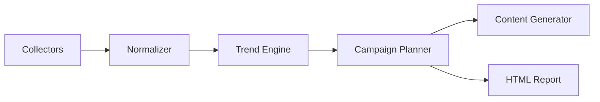

# 03. Architecture

# System Architecture

## 목적

본 문서는 Codex가 그대로 구현할 수 있도록 전체 시스템 구조를 정의한다.

---

# 전체 흐름

```text
User
  │
  ▼
Codex Plugin
  │
  ▼
Skill
  │
  ▼
Workflow Engine
  │
  ├── Collector
  ├── Normalizer
  ├── Trend Analyzer
  ├── Campaign Planner
  ├── Content Generator
  └── Report Generator
```

---

# Directory

```text
src/
├── .codex-plugin/
├── skills/
├── collectors/
│   ├── instagram.py
│   ├── facebook.py
│   ├── naver_blog.py
│   ├── news.py
│   ├── weather.py
│   ├── exchange.py
│   ├── holidays.py
│   └── trends.py
├── normalizers/
├── analyzers/
├── planners/
├── generators/
├── reports/
├── templates/
├── data/
│   ├── raw/
│   ├── normalized/
│   └── reports/
└── utils/
```

---

# Module Responsibilities

## Collectors
공개 데이터를 수집한다.

Output:
JSON

---

## Normalizer

모든 데이터를 동일한 Schema로 변환한다.

Output:

normalized.json

---

## Trend Analyzer

입력

- SNS
- News
- Weather
- Exchange
- Holidays

출력

Trend Score

---

## Campaign Planner

Trend Score를 기반으로

추천 여행지
추천 상품
추천 캠페인

생성

---

## Content Generator

생성 대상

- Instagram
- Facebook
- Naver Blog
- Image Prompt

---

## Report Generator

생성

report/index.html

report/report.md

charts.json

---

# Data Flow

raw

↓

normalized

↓

trend score

↓

campaign

↓

content

↓

html report

---

# Mermaid



---

# Development Rule

각 Module은

- 독립 실행 가능
- Unit Test 가능
- JSON 입출력
- Interface 기반 구현

---

# 완료 조건

□ Collector 구현

□ Normalizer 구현

□ Trend Engine 구현

□ Campaign Planner 구현

□ Content Generator 구현

□ HTML Report 구현

□ Integration Test 통과
