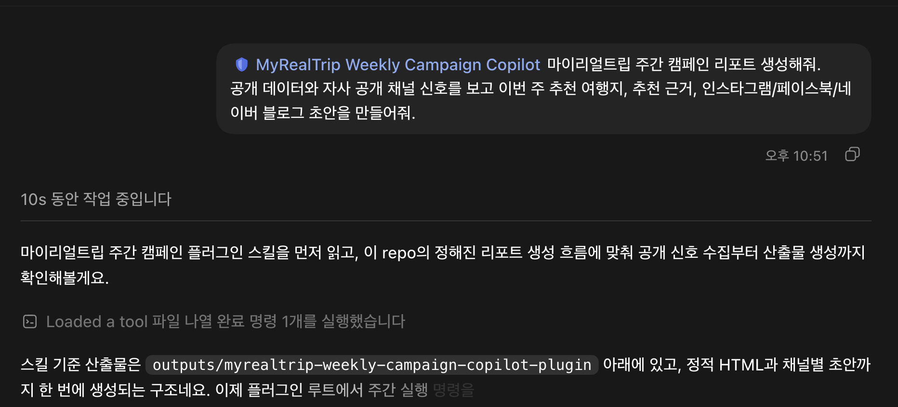

# 마이리얼트립 주간 캠페인 코파일럿

마이리얼트립 마케팅팀과 MD가 매주 “이번 주 어떤 여행 상품을 홍보할까?”를 판단할 수 있도록 돕는 Codex 플러그인입니다.

공개 데이터와 자사 공개 채널 신호를 수집하고, 추천 여행지와 캠페인 초안, HTML 리포트를 생성합니다.

## 누가 쓰나요?

- 마케팅팀
- MD
- 콘텐츠 담당자
- 상품기획자

여행객용 서비스가 아니라 내부 캠페인 기획용 도구입니다.

## 무엇을 생성하나요?

일반 사용자는 아래 파일만 먼저 보면 됩니다.

- `reports/index.html`: 한글 HTML 리포트
- `reports/result.md`: 한 화면 요약 결과
- `reports/instagram.md`: 인스타그램 초안
- `reports/facebook.md`: 페이스북 초안
- `reports/naver_blog.md`: 네이버 블로그 초안
- `reports/image_prompt.md`: 이미지 생성 프롬프트
- `submission.zip`: 제출용 압축 파일

SNS 초안 파일에는 바로 붙여넣을 수 있는 `복사 영역`, 채널별 `이미지 생성 프롬프트`, `이미지 표시 영역`이 함께 들어갑니다.

Codex에 이미지 생성 권한이 있는 경우 각 프롬프트로 이미지를 생성해 아래 경로에 저장하면, SNS 파일 안에서 이미지가 바로 표시됩니다.

- `reports/assets/instagram-campaign.png`
- `reports/assets/facebook-campaign.png`
- `reports/assets/naver-blog-campaign.png`

아래 JSON 파일은 개발자나 심사자가 상세 검증할 때 쓰는 파일입니다. 일반 사용자는 열지 않아도 됩니다.

- `reports/data.json`: 리포트 원천 데이터
- `reports/recommendation.json`: 추천 여행지와 근거
- `reports/campaign.json`: 캠페인 실행안

## 사용하는 데이터

기본 실행은 API 키 없이 동작합니다.

- 네이버 블로그: 실데이터 수집
- 뉴스: 실데이터 수집
- 환율: 실데이터 수집
- 날씨: 실데이터 수집
- 인스타그램: 공개 URL은 기록하지만 게시글 단위 수집은 샘플 사용
- 페이스북: 공개 URL은 기록하지만 게시글 단위 수집은 샘플 사용
- 휴일: 샘플 사용
- 항공권 가격: 샘플 사용

인스타그램과 페이스북 게시글 실데이터는 공개 페이지만으로 안정 수집하기 어렵기 때문에, 소유 계정 API 권한이나 게시글 내보내기 파일이 있을 때 확장하는 구조입니다.

## Codex에 등록해서 설치하는 방법

이 저장소를 GitHub에 올린 뒤, 내려받은 저장소 루트에서 아래 순서로 등록하고 설치합니다.

```bash
codex plugin marketplace add .local-codex-marketplace
codex plugin add myrealtrip-weekly-campaign-copilot@hackathon-local
```

설치 여부는 아래 명령으로 확인합니다.

```bash
codex plugin list
```

목록에 `myrealtrip-weekly-campaign-copilot@hackathon-local`이 `installed, enabled`로 보이면 설치된 것입니다.

## Codex에서 사용하는 예시

설치 후 새 Codex 스레드에서 플러그인 이름을 붙여 자연어로 요청하면 됩니다.

```text
MyRealTrip Weekly Campaign Copilot 마이리얼트립 주간 캠페인 리포트 생성해줘.
공개 데이터와 자사 공개 채널 신호를 보고 이번 주 추천 여행지, 추천 근거,
인스타그램/페이스북/네이버 블로그 초안을 만들어줘.
```

Codex는 플러그인 스킬을 읽고 정해진 리포트 생성 흐름에 맞춰 공개 신호 수집부터 HTML 리포트와 채널별 초안 생성까지 진행합니다.

결과는 `reports/result.md` 요약과 `reports/index.html` 리포트를 먼저 보면 됩니다. `data.json`, `recommendation.json`, `campaign.json`은 개발자나 심사자가 상세 검증할 때 쓰는 파일이라 일반 사용자는 열지 않아도 됩니다.



## 직접 실행하는 방법

플러그인 폴더에서 실행합니다.

```bash
cd /Users/hdh/Desktop/git/hackerton-ax-myrealtrip/outputs/myrealtrip-weekly-campaign-copilot-plugin
python3 -m campaign_copilot.cli run-weekly
```

성공하면 터미널에는 사용자용 요약이 바로 출력됩니다. 더 자세히 보려면 `reports/index.html`을 브라우저로 열어 결과를 확인합니다.

```bash
open reports/index.html
```

개발/검증용 JSON 출력이 필요할 때만 아래처럼 실행합니다.

```bash
python3 -m campaign_copilot.cli run-weekly --json
```

## 검증 방법

```bash
python3 -m unittest discover -s tests
python3 -m campaign_copilot.cli run-weekly
python3 /Users/hdh/.codex/skills/.system/plugin-creator/scripts/validate_plugin.py /Users/hdh/Desktop/git/hackerton-ax-myrealtrip/outputs/myrealtrip-weekly-campaign-copilot-plugin
python3 -m zipfile -t submission.zip
```

프론트엔드 빌드나 Node.js는 필요하지 않습니다. HTML 리포트는 정적 파일입니다.

## 데이터 수집 흐름

```text
수집기
-> 정규화
-> 트렌드 분석
-> 캠페인 기획
-> 콘텐츠 생성
-> HTML 리포트
```

## 인증서 정책

공개 데이터 수집 요청은 로컬 Python 인증서 저장소 차이로 실행이 막히지 않도록 인증서 검증을 비활성화합니다.

이 플러그인은 비밀정보나 내부 데이터베이스를 전송하지 않고 공개 URL만 조회합니다.

## 알려진 한계

자세한 내용은 [ISSUES.md](ISSUES.md)를 확인하세요.
